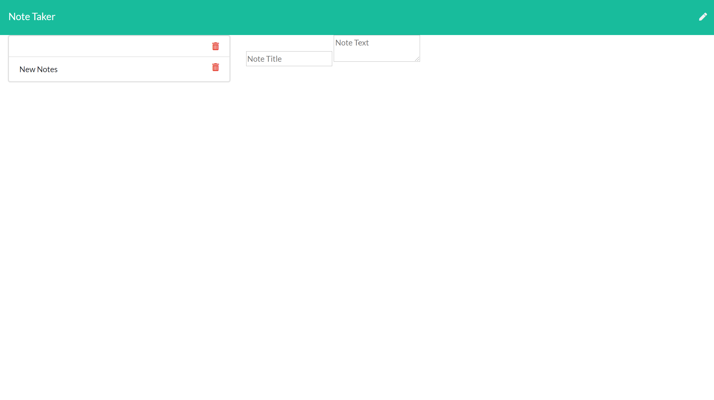

# NOTE TAKER APP

## Description 
This application creates notes for the user to add and delete their notes. The notes will be stored on the side of the screen. 

## Instructions 
* The user loads the page and clicks the pen to add a new note
* Then th user clicks the save icon to save the note
* If the user wants to delete the note the user clicks the trashcan on the saved note

## Installation 
* Node
* File-system
* Express

